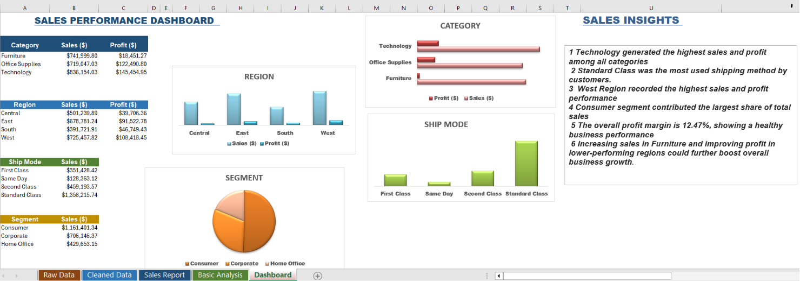

# Retail Business Performance Analysis using Microsoft Excel

## Project Overview
This project was completed as part of the **Excel Skills for Business: Essentials** course by **Macquarie University**.

The goal of this project is to analyze retail sales data and create a clear, easy-to-understand Excel dashboard that supports business decision-making.

## Dashboard Overview 

 

## Project Objectives
- Clean and organize raw sales data
- Analyze sales and profit performance
- Compare categories, regions, customer segments, and shipping modes
- Build a professional dashboard
- Generate simple business insights

## Tools Used
- Microsoft Excel
- Data Cleaning
- Tables
- Basic Formulas
- Charts
- Business Analysis

## Key Insights
- Technology generated the highest sales and profit.
- West region performed the best.
- Standard Class was the most used shipping method.
- Consumer segment contributed the highest sales.
- Overall profit margin remained healthy.

## Files Included
- Sales_Performance_Dashboard.xlsx
- Dashboard Screenshot
- README.md

## Author
**Rudra Sharma**
